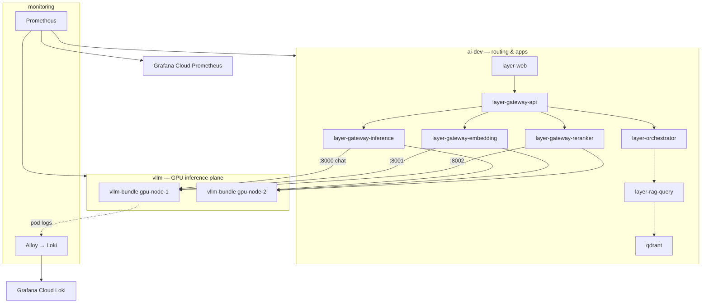

# HuntAI k3s architecture

Homelab layout: **k3s** on `server-node-1`, GPU workers `gpu-node-1` / `gpu-node-2`, GitOps via **Argo CD**, metrics/logs to **Grafana Cloud**.

## Planes

| Plane | Namespace | What runs there |
|-------|-----------|-----------------|
| **GPU / vLLM** | `vllm` | One bundle pod per GPU node: chat `:8000`, embed `:8001`, rerank `:8002` |
| **Routing / apps (dev)** | `ai-dev` | GPU gateways, Qdrant, MCP, dev user stack, Cloudflare tunnel |
| **User stack (prod)** | `ai-prod` | gateway-api, orchestrator, RAG, web (backends in `ai-dev` / `vllm`) |
| **Observability** | `monitoring` | Prometheus (scrape + remote_write), Alloy (pod logs → Loki) |
| **GPU telemetry** | `gpu-operator` | DCGM exporter (scraped as `workload=gpu-telemetry`) |

Port map: [port.md](port.md). GitOps: Argo CD projects **platform** / **ai-dev** / **ai-prod** — [deploy-gitops-argocd.md](deploy-gitops-argocd.md).

## Backend discovery (gateways → vLLM)

Gateways in `ai-dev` call into `vllm`. **Per-GPU** routing needs one stable URL per node (not the aggregate Service `vllm-inference`, which load-balances across both bundles).

| Gateway | Backends | URL pattern | Port |
|---------|----------|-------------|------|
| **Embedding** | `embed-node-1`, `embed-node-2` | `http://vllm-embed-gpu-node-{N}.vllm.svc.cluster.local` | 8001 |
| **Reranker** | `reranker-node-1`, `reranker-node-2` | `http://vllm-rerank-gpu-node-{N}.vllm.svc.cluster.local` | 8002 |
| **Inference (chat)** | `gpu-node-1`, `gpu-node-2` | `http://vllm-chat-gpu-node-{N}.vllm.svc.cluster.local` | 8000 |

Configured in:

- `manifests/gateway-embedding/base/deployment.yaml` — `EMBED_BACKENDS`
- `manifests/gateway-reranker/base/deployment.yaml` — `RERANK_BACKENDS`
- `manifests/gateway-inference/base/configmap.yaml` — `backends[].url`

### Chat backends (current)

Inference gateway uses per-node ClusterIP DNS (same pattern as embed/rerank):

- `http://vllm-chat-gpu-node-1.vllm.svc.cluster.local:8000`
- `http://vllm-chat-gpu-node-2.vllm.svc.cluster.local:8000`

NodePort `30080` on `inference-qwen25-7b` is for **direct** vLLM smokes from GPU node LAN IPs only — not for gateway `config.yaml` backends.

**Prod orchestrator/RAG** in `ai-prod` call shared **dev** GPU stack via FQDN (`*.ai-dev.svc.cluster.local`) — see [deploy-prod.md](deploy-prod.md).

### Aggregate Services (avoid for gateway backends)

| Service | Selector | Use |
|---------|----------|-----|
| `vllm-inference` | `app=vllm-bundle` | Prometheus job `vllm-inference` (all pods) |
| `inference-qwen25-7b` | `app=vllm-bundle` | NodePort 30080 — LAN/debug only |

## Metrics and dashboards

Prometheus jobs label `workload=inference|embedding|reranker` and `node=gpu-node-1|gpu-node-2`. Chat exposes **three** `model_name` series per GPU (base + SFT + DPO LoRAs) — see [deploy-prometheus.md](deploy-prometheus.md).

Grafana JSON: [grafana-import/README.md](../grafana-import/README.md), versions in [grafana-import/VERSIONS.md](../grafana-import/VERSIONS.md).

## Secrets

- App secrets: `ai-dev` — [cluster-secrets.md](cluster-secrets.md)
- Grafana Cloud: `monitoring` — [secrets/README.md](../secrets/README.md) (not in Argo manifests)

## Repo naming map

| You see | Meaning |
|---------|---------|
| Argo `mcp-github-dev` | `manifests/tool/overlays/dev` — GitHub MCP (`layer-mcp-github`) |
| `manifests/tool/` | Historical path name; not a separate runtime “tool plane” |
| Service `layer-*` | Container / image name from upstream repos |

## Related runbooks

- vLLM cutover `ai` → `vllm`: [fix-vllm-plane-cutover.md](fix-vllm-plane-cutover.md)
- Component deploy index: [deploy-workloads-and-observability.md](deploy-workloads-and-observability.md)
