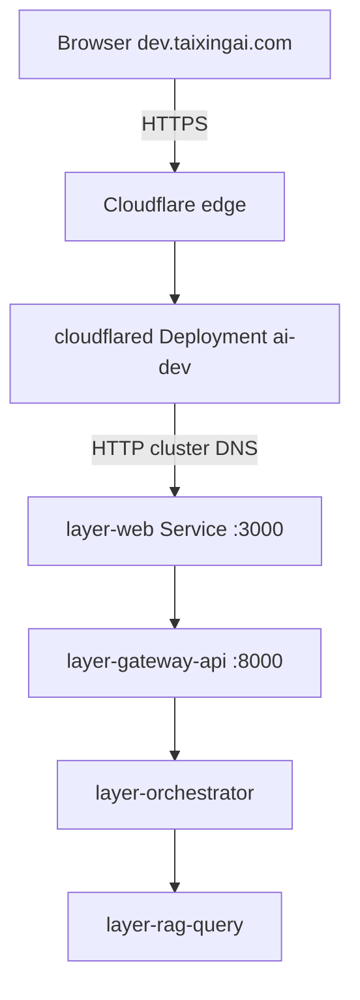

# Dev public URL — Cloudflare Tunnel (`dev.taixingai.com`)

Expose the dev HuntAI web UI over HTTPS without opening inbound ports. **Dev only** — prod (`ai-prod`, apex DNS) is a separate tunnel manifest later.

## Architecture (recommended: in-cluster)



| Layer | Kubernetes name | Notes |
|-------|-----------------|--------|
| Tunnel connector | **`cloudflared`** Deployment | [`manifests/ingress/cloudflared-dev.yaml`](../manifests/ingress/cloudflared-dev.yaml) |
| Web UI + BFF | **`layer-web`** Service | Image `layer-web-v1`; port **3000** |
| Gateway | **`layer-gateway-api`** | ClusterIP only |
| NodePort (LAN debug) | **30186** | Optional; not used by in-cluster tunnel |

Backend URL inside the cluster:

`http://layer-web.ai-dev.svc.cluster.local:3000`

## Prerequisites

- [deploy-layer-web.md](deploy-layer-web.md) and [deploy-gateway-api.md](deploy-gateway-api.md) applied in `ai-dev`
- Cloudflare tunnel already created; credentials JSON on the server (e.g. `~/.cloudflared/*.json`)
- `APP_URL` / `FRONTEND_URL` = `https://dev.taixingai.com` in dev manifests
- DNS route for `dev.taixingai.com` (one-time; see §3)

## 1) Confirm stack

```bash
sudo k3s kubectl -n ai-dev get svc layer-web -o wide
sudo k3s kubectl -n ai-dev get pods -l app=layer-web
sudo k3s kubectl -n ai-dev get pods -l 'app in (layer-gateway-api,layer-orchestrator)'
```

In-cluster sanity (from any pod with curl, or after cloudflared is up):

```bash
sudo k3s kubectl -n ai-dev run curl-test --rm -it --restart=Never \
  --image=curlimages/curl:latest -- \
  curl -sS -o /dev/null -w "%{http_code}\n" http://layer-web.ai-dev.svc.cluster.local:3000/
```

Expect **200**. LAN NodePort (optional):

```bash
curl -sS -o /dev/null -w "%{http_code}\n" http://127.0.0.1:30186/
```

## 2) Create tunnel credentials Secret

**Do not commit** `credentials.json` to git.

```bash
sudo k3s kubectl create secret generic cloudflared-tunnel-credentials -n ai-dev \
  --from-file=credentials.json="$HOME/.cloudflared/ccaafc35-b73f-4df6-ba51-d85b2e5f9bcf.json" \
  --dry-run=client -o yaml | sudo k3s kubectl apply -f -
```

Verify:

```bash
sudo k3s kubectl -n ai-dev get secret cloudflared-tunnel-credentials
```

## 3) DNS route (one-time)

```bash
cloudflared tunnel route dns ccaafc35-b73f-4df6-ba51-d85b2e5f9bcf dev.taixingai.com
```

## 4) Apply in-cluster cloudflared

If you previously ran **host** `cloudflared` or `systemd cloudflared`, stop it first (duplicate connectors can cause flaky routing):

```bash
sudo systemctl stop cloudflared 2>/dev/null || true
pkill -f 'cloudflared tunnel' 2>/dev/null || true
```

Deploy:

```bash
cd ~/shared/k3s
sudo k3s kubectl apply -f manifests/ingress/cloudflared-dev.yaml
sudo k3s kubectl -n ai-dev rollout status deployment/cloudflared --timeout=120s
sudo k3s kubectl -n ai-dev get pods -l app=cloudflared -o wide
sudo k3s kubectl -n ai-dev logs deploy/cloudflared --tail=30
```

Expect logs like `Registered tunnel connection` and no credential errors.

## 5) HTTPS URLs on web + gateway

| Variable | Service | Value |
|----------|---------|--------|
| `APP_URL` | layer-web | `https://dev.taixingai.com` |
| `COOKIE_SECURE` | layer-web | `true` |
| `FRONTEND_URL` | layer-gateway-api | `https://dev.taixingai.com` |

```bash
sudo k3s kubectl apply -f manifests/web/layer-web-dev.yaml
# Gateway API: managed by Argo CD (gateway-api-dev); push manifest changes or sync in UI
sudo k3s kubectl rollout restart deployment/layer-web deployment/layer-gateway-api -n ai-dev
```

## 6) Supabase Dashboard (manual)

- **Site URL** = `https://dev.taixingai.com`
- **Redirect URLs** = `https://dev.taixingai.com/auth/reset-password`

## 7) Smoke test

```bash
curl -I https://dev.taixingai.com
curl -I https://dev.taixingai.com/chat
```

Browser: `https://dev.taixingai.com/login` → `/chat`.

## Alternative: host-run cloudflared (legacy)

Use only for quick debugging without applying the Deployment. On **server-node-1**, cluster DNS from the host may fail; use NodePort:

```yaml
# ~/.cloudflared/config.yml (not in git)
ingress:
  - hostname: dev.taixingai.com
    service: http://127.0.0.1:30186
  - service: http_status:404
```

Run: `cloudflared tunnel run <tunnel-id>`. Do **not** run host and in-cluster connectors at the same time.

## Troubleshooting

| Symptom | Check |
|---------|--------|
| `CreateContainerConfigError` | Secret `cloudflared-tunnel-credentials` §2 |
| Pod CrashLoop | `kubectl logs deploy/cloudflared`; credentials path; tunnel ID in ConfigMap |
| **502** from Cloudflare | `layer-web` Ready; `curl` from debug pod to `layer-web:3000` |
| **404** hostname | DNS route §3; `dev.taixingai.com` in ConfigMap ingress |
| Duplicate / flaky tunnel | Only one connector: stop host systemd **or** scale in-cluster to 0 |
| Login OK, chat **401** | Gateway secrets; `APP_URL` / `FRONTEND_URL` HTTPS |
| Wrong reset link | Supabase Site URL |

## Prod (later)

Copy pattern to `manifests/ingress/cloudflared-prod.yaml` in `ai-prod`, separate tunnel Secret and hostname (e.g. `taixingai.com`). Not in this pass.
